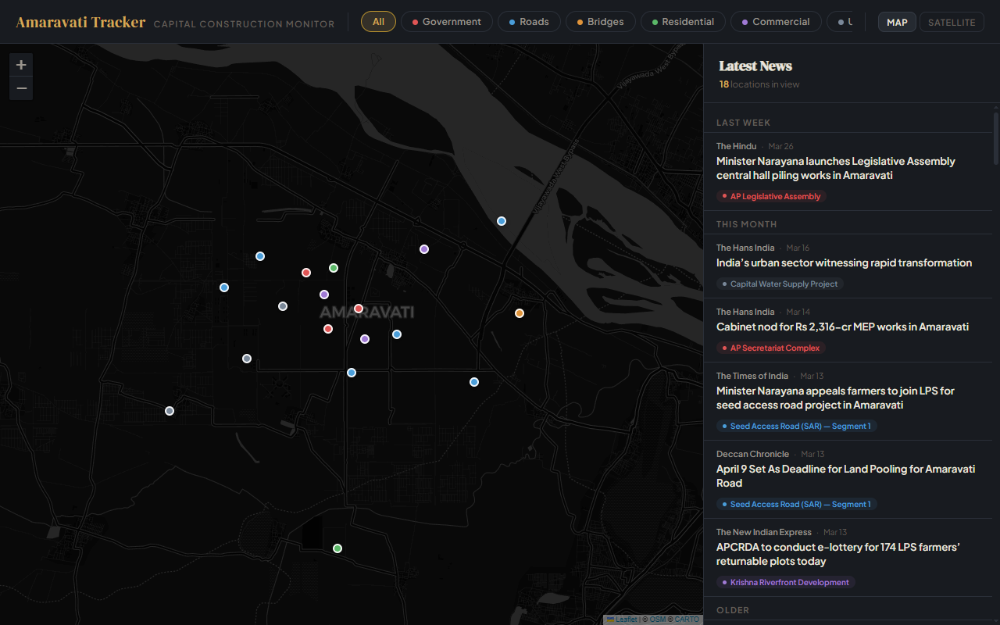
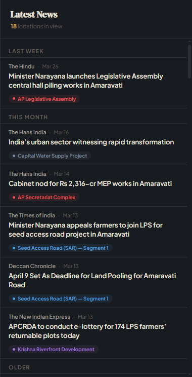

# Amaravati Capital Tracker

An interactive map tracking construction and infrastructure progress in Amaravati, Andhra Pradesh's capital region. Live news and YouTube feeds update automatically based on the visible map area — pan and zoom to discover content for different locations.

**Production:** https://sahitkogs.github.io/amaravati-tracker/
**Staging:** https://sahitkogs.github.io/amaravati-tracker-staging/




## Features

- **Interactive map** with 20 tracked construction/infrastructure locations
- **Live news feed** — fetches real Google News articles via RSS, sorted chronologically
- **YouTube video feed** — fetches recent videos via YouTube Data API v3
- **Time-grouped** — articles and videos grouped by Today, This Week, This Month, Older
- **Location tags** — each item is tagged with its construction project (color-coded by category)
- **Deduplication** — same article/video appearing across multiple location searches is shown once
- **Viewport-driven** — sidebar updates automatically as you pan and zoom
- **Category filters** — Government, Roads, Bridges, Residential, Commercial, Utilities
- **Map/Satellite toggle** — CartoDB dark tiles and Esri satellite imagery
- **Mobile responsive** — map stacks above sidebar on small screens

## Tech Stack

- **Leaflet.js** (CDN) — map rendering
- **CartoDB Dark** / **Esri Satellite** — tile layers
- **Google News RSS** — live article feeds via Cloudflare Worker
- **YouTube Data API v3** — video feeds via Cloudflare Worker
- **Cloudflare Workers** — serverless proxy with edge caching, CORS handling, and API key management
- **Vanilla HTML/CSS/JS** — no frameworks, no build tools

## Architecture

### Data Flow

Both news and YouTube data flow through a Cloudflare Worker that handles CORS, caching, and API key management. The client never talks to Google or YouTube directly.

```
┌──────────────────────────────────────────────┐
│               User's Browser                  │
│                                               │
│   ┌─────────────┐       ┌──────────────┐     │
│   │  News Tab   │       │ YouTube Tab  │     │
│   └──────┬──────┘       └──────┬───────┘     │
│          │                     │              │
│     localStorage          localStorage        │
│     (2hr TTL)             (2hr TTL)           │
└──────────┼─────────────────────┼──────────────┘
        miss?                 miss?
           │                     │
           └──────────┬──────────┘
                      ▼
    ┌──────────────────────────────────────────┐
    │         Cloudflare Worker                 │
    │  cors-proxy.sahit-koganti.workers.dev     │
    │                                           │
    │  /news/search?q=...  /youtube/search?q=.. │
    │                                           │
    │  ┌──────────────────────────────────────┐ │
    │  │       Cloudflare Edge Cache           │ │
    │  │            (6hr TTL)                  │ │
    │  │                                       │ │
    │  │  All users share cached results.      │ │
    │  │  20 search terms x 4 refreshes/day    │ │
    │  │  = only ~80 upstream calls/day        │ │
    │  └──────────────┬───────────────────────┘ │
    │              miss?                         │
    │        ┌────────┴────────┐                │
    │        ▼                 ▼                │
    │  ┌───────────┐   ┌─────────────────┐     │
    │  │  Google   │   │  YouTube Data   │     │
    │  │  News RSS │   │  API v3         │     │
    │  │  (public) │   │  (API key kept  │     │
    │  │           │   │   as Worker     │     │
    │  │           │   │   secret)       │     │
    │  └───────────┘   └─────────────────┘     │
    └──────────────────────────────────────────┘
```

### Caching Strategy

Both news and YouTube use the same three-layer cache:

1. **Client localStorage** (2hr TTL) — each browser caches results locally, avoiding Worker calls on repeat visits
2. **Cloudflare Edge Cache** (6hr TTL) — all users worldwide share cached results per search term. A search for "Amaravati Secretariat" hits the upstream source once every 6 hours, regardless of how many users request it
3. **Upstream source** — Google News RSS (free, no key) or YouTube Data API v3 (API key stored as Worker secret, never exposed to browser)

**YouTube quota math:** 20 search terms x 4 cache refreshes/day = ~8,100 units/day (free tier: 10,000 units/day). User count doesn't affect quota.

## Environments

### Staging vs Production

| | Staging | Production |
|---|---|---|
| **Site** | [amaravati-tracker-staging](https://sahitkogs.github.io/amaravati-tracker-staging/) | [amaravati-tracker](https://sahitkogs.github.io/amaravati-tracker/) |
| **Worker** | `cors-proxy-staging.sahit-koganti.workers.dev` | `cors-proxy.sahit-koganti.workers.dev` |
| **Git remote** | `staging` | `prod` |
| **Edge cache** | Separate | Separate |
| **API quota** | Shared (same YouTube API key) | Shared (same YouTube API key) |

The client auto-detects which environment it's on via the URL and routes to the correct Worker.

### Deployment

```bash
# Deploy site to STAGING (default workflow)
git push staging main

# Deploy site to PRODUCTION (only when explicitly ready)
git push prod main

# Deploy Worker to staging
cd cors-proxy
wrangler deploy --env staging

# Deploy Worker to production
cd cors-proxy
wrangler deploy
```

Normal development pushes go to staging. Production deploys are explicit.

## Getting Started

This project uses separate files during development. You need a local server (browsers block `file://` cross-file loading).

```bash
# Option 1: npx
npx serve .

# Option 2: Python
python -m http.server 8000

# Option 3: VS Code Live Server extension
# Right-click index.html -> "Open with Live Server"
```

Then open `http://localhost:3000` (or whichever port is shown). Local development uses the **staging** Worker automatically.

## File Structure

```
index.html          — HTML skeleton, loads all dependencies
styles.css          — All CSS (layout, sidebar, markers, responsive)
data.js             — Location data array + config constants
app.js              — Map init, markers, news/video fetching, sidebar rendering, filters
cors-proxy/         — Cloudflare Worker (news + YouTube proxy with edge cache)
  worker.js         — Worker source code
  wrangler.toml     — Cloudflare deployment config (staging + production)
plans/              — Implementation plan docs
tests/images/       — Playwright test screenshots
```

## Adding Locations

Edit `data.js` and add an entry to the `LOCATIONS` array:

```js
{
  id: "loc_021",
  name: "Your Location Name",
  nameLocal: "తెలుగు పేరు",        // Telugu name (optional)
  category: "government",           // government|road|bridge|residential|commercial|utility
  lat: 16.5100,
  lng: 80.5200,
  status: "under_construction",     // completed|under_construction|planned|stalled
  description: "Short description of the project.",
  searchKeywords: "keywords for Google News and YouTube search",
  lastUpdated: "2026-04-01"
}
```

Tip: search your `searchKeywords` on [Google News](https://news.google.com) and [YouTube](https://youtube.com) first to verify they return relevant results.

## Setting Up the Cloudflare Worker

For your own deployment:

```bash
cd cors-proxy
npm install -g wrangler
wrangler login

# Set API key for both environments
wrangler secret put YOUTUBE_API_KEY                # production
wrangler secret put YOUTUBE_API_KEY --env staging  # staging

# Deploy both
wrangler deploy              # production
wrangler deploy --env staging  # staging
```

To create a YouTube API key:
1. Create a project at [Google Cloud Console](https://console.cloud.google.com)
2. Enable the **YouTube Data API v3**
3. Create an API key, restrict it to YouTube Data API only (no referrer restriction needed since the key stays server-side)

Update `WORKER_BASE` in `app.js` to point to your Worker URLs.

## License

MIT
