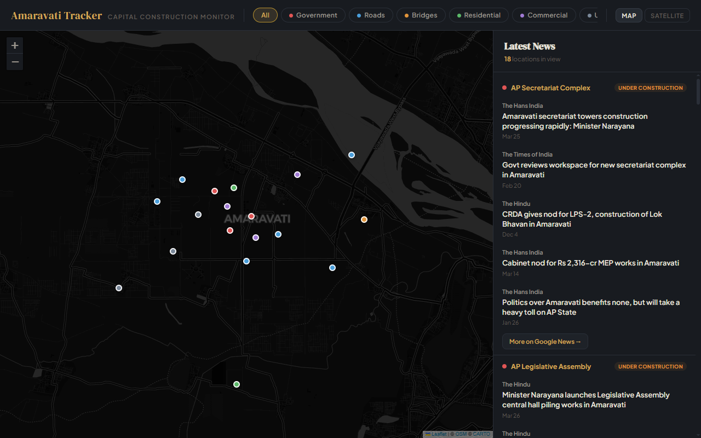

# Amaravati Capital Tracker

An interactive map that tracks construction and infrastructure progress in Amaravati, Andhra Pradesh's capital region. The sidebar displays live Google News articles for locations visible in the current map viewport.



## Features

- **Interactive map** with 20 tracked construction/infrastructure locations
- **Live news feed** — fetches real Google News articles per location via RSS
- **Viewport-driven** — sidebar updates automatically as you pan and zoom
- **Category filters** — Government, Roads, Bridges, Residential, Commercial, Utilities
- **Map/Satellite toggle** — switch between CartoDB dark tiles and Esri satellite imagery
- **Mobile responsive** — map stacks above sidebar on small screens

## Tech Stack

- **Leaflet.js** (CDN) — map rendering
- **CartoDB Dark** / **Esri Satellite** — tile layers
- **Google News RSS** — live article feeds via corsproxy.io
- **Vanilla HTML/CSS/JS** — no frameworks, no build tools

## Getting Started

This project uses separate files during development. You need a local server (browsers block `file://` cross-file loading).

```bash
# Option 1: npx
npx serve .

# Option 2: Python
python -m http.server 8000

# Option 3: VS Code Live Server extension
# Right-click index.html -> "Open with Live Server"
```

Then open `http://localhost:3000` (or whichever port is shown).

## File Structure

```
index.html      — HTML skeleton, loads all dependencies
styles.css      — All CSS (layout, sidebar, markers, responsive)
data.js         — Location data array + config constants (categories, statuses)
app.js          — Map init, markers, news fetching, sidebar rendering, filters
plans/          — Implementation plan docs
tests/images/   — Playwright test screenshots
```

## Adding Locations

Edit `data.js` and add an entry to the `LOCATIONS` array:

```js
{
  id: "loc_021",
  name: "Your Location Name",
  nameLocal: "తెలుగు పేరు",        // Telugu name (optional)
  category: "government",           // government|road|bridge|residential|commercial|utility
  lat: 16.5100,
  lng: 80.5200,
  status: "under_construction",     // completed|under_construction|planned|stalled
  description: "Short description of the project.",
  searchKeywords: "keywords for Google News search",
  lastUpdated: "2026-04-01"
}
```

Tip: search your `searchKeywords` on [Google News](https://news.google.com) first to verify they return relevant results.

## Building for Distribution

To produce a single shareable HTML file, inline all CSS and JS back into `index.html`. The plan is to do this at the end when ready to deploy.

Hosting options: GitHub Pages, Cloudflare Pages, Netlify — just upload the single file.

## License

MIT
