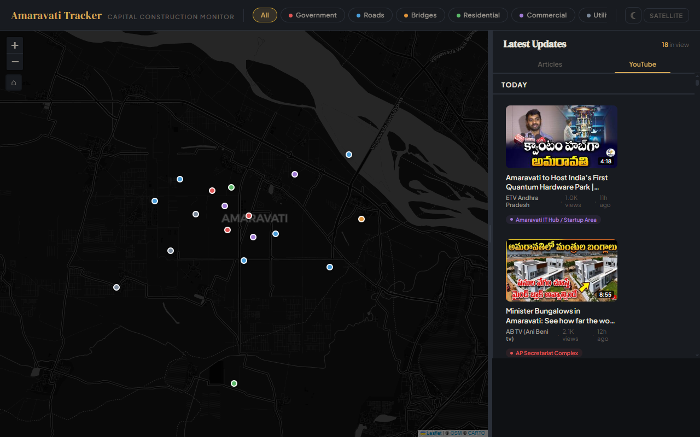

# Sidebar Bottom Gap — Resolved

## Problem

The YouTube tab in the sidebar leaves visible empty space at the bottom, below the last video grid. The Articles tab does not have this issue.

### Screenshots

Desktop — YouTube tab with empty bottom gap:


User-annotated — the gap is visible below the last row of video cards:


## Why Articles Works

Articles are block-level `<a>` elements that stack vertically with `border-bottom` separators. They flow continuously and naturally fill the width. The content is a flat list — no wrapper with its own layout constraints.

## Why YouTube Breaks

The YouTube tab uses `.video-grid` with `display: flex; flex-wrap: wrap` and fixed `220px` wide cards. After the last row of cards, the flex container ends at its content height. The remaining sidebar-body height below is empty.

## What Was Tried

1. **Matching backgrounds** — Set `bg-surface` on sidebar, sidebar-body, video-grid, and articles. Removed redundant layered backgrounds. The empty area still appears visually different or noticeably empty.

2. **Video-feed flex wrapper** — Wrapped all video output in a `.video-feed` div with `display: flex; flex-direction: column; min-height: 100%`. Gave the last `.video-grid` element `flex: 1` to stretch. Didn't resolve the gap.

3. **More content** — Increased videos per location from 6 to 10, articles from 5 to 8. Helps fill more space but doesn't eliminate the gap when content is shorter than the sidebar height.

4. **Sidebar layout changes** — Tried `align-items: stretch` on `.main-layout`, `flex: 1 1 0` with `min-height: 0` on `.sidebar-body`, `overflow-y: auto` for scrolling.

## Current CSS Structure

```
.sidebar (flex column, overflow: hidden, bg-surface)
  .sidebar-drag-zone (flex-shrink: 0, bg-surface)
    .sidebar-drag-handle
    .sidebar-header (tabs: Articles | YouTube)
  .sidebar-body (flex: 1 1 0, overflow-y: auto, bg-surface, min-height: 0)
    [content rendered here]
```

For YouTube tab, the content is:
```
.video-feed (flex column, min-height: 100%)
  .time-group-header
  .video-grid (flex-wrap, 220px cards)
  .time-group-header
  .video-grid.video-grid-last (flex: 1)
```

## Possible Root Causes to Investigate

1. **flex-wrap + flex: 1 interaction** — A flex container with `flex-wrap: wrap` and `flex: 1` grows its height but the cards inside still align to the top. The stretched area below the last row of cards is empty flex space, not missing content.

2. **min-height: 100% on video-feed** — The `100%` refers to the sidebar-body's height, which itself is determined by flex. This might not resolve correctly in all browsers.

3. **overflow-y: auto creates a new BFC** — The sidebar-body's `overflow-y: auto` creates a block formatting context. The `min-height: 100%` on `.video-feed` might not reference the scrollable area's full height.

## Resolution

**Root cause:** The `flex: 1` on `.video-grid-last` stretched the last grid container, but `flex-wrap` cards inside pinned to the top — the extra height was empty space inside the grid. Matching backgrounds didn't help because the issue was visual emptiness (no content), not color mismatch.

**Fix applied:**
1. Removed `.video-grid-last` class and its `flex: 1` CSS rule (ineffective stretch)
2. Removed `isLast` logic from `app.js` that applied the class
3. Added `.video-feed::after` pseudo-element with `flex: 1` and a gradient from `--bg-surface` to `--bg-deep`

**How it works:** The `.video-feed` keeps `min-height: 100%` so it fills the sidebar-body. The `::after` with `flex: 1` grows to fill any remaining space below the last grid. Its gradient creates a smooth visual fade to the page background, making the end of content look intentional.

**When content overflows** (enough videos to scroll), the `::after` gets 0 height and is invisible — no visual impact on scrollable content.
